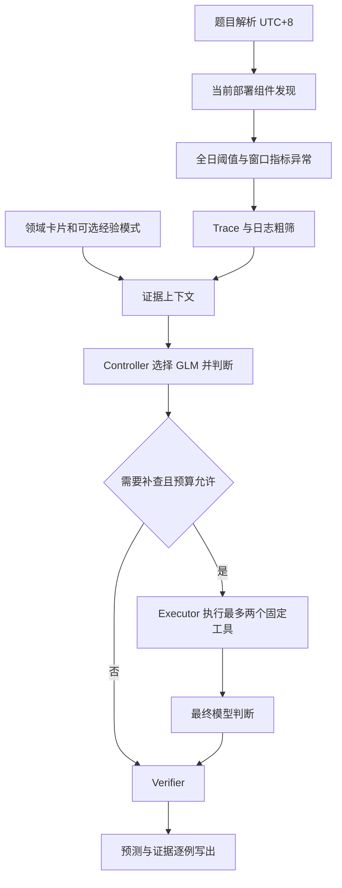

# 架构与流程

## 设计目标

针对 30 分钟窗口内的 1–多个故障，在大 CSV 上取回少量可回查证据。
尽量把数值计算、格式处理和检索执行留给代码，让模型只承担根因比较。
小规模原型优先控制依赖、模型往返和可复查性；不宣称全局最优。

## Agent 角色

- **Controller**：先运行固定粗筛。单故障且遥测齐全时先用快速模型；多故障、没有指标候选、缺少模态或查询失败时先用强模型。候选组件数量只记录，不再直接触发升级。快速模型请求补查或返回低置信度诊断时，第二轮可升级。这是待校准的成本策略。
- **Executor**：`Tools.call` 的确定性分派器。每个工具有 JSON Schema，只可读取八类遥测文件。内部使用参数化 SQL，不接受模型传入 SQL/Python。
- **Verifier**：检查故障数、时间范围、已发现的组件、15 类原因、置信度格式和证据 ID。可归一化 alternatives 的字符串/null/对象；转换有记录，不改评分字段。首轮契约错误可使用第二轮纠错；仍失败则回退，若已有校验通过的低置信度模型草稿则保留该草稿。

只 Controller 调模型。JSON action 协议可用于没有稳定原生 tool calling 的兼容端点。
本地 fake-model 测试验证一次补查路径，不能视作真实模型质量评测。

## 对 OpenRCA 提示词的借鉴与调整

保留：分阶段诊断、先算全序列阈值再筛窗口、区分单点噪声与持续异常、使用 trace/logs、UTC+8、查看真实 KPI 名和实际执行结果。

调整：

- 将运行时写代码换成固定工具，省去每个数据步骤的代码生成和自然语言总结调用。
- 即使指标不明显，也做 trace/log 粗筛，降低指标先筛造成的网络故障漏检。
- 将“最下游故障组件”“最大异常”等视为待验证假设，不作为普适因果规则。
- 组件集合由当前数据发现；不会硬编码 cloudbed-1 的根因答案。
- 缓存允许写到 `--out/cache`，原始数据只读。
- 领域/经验卡片不是故障证据，最终答案要求引用成功的遥测查询。

## 查询与缓存

`store.py` 用明确列类型读取 CSV，status_code 一律保留字符串。
大型日志和 trace 先筛时间窗口，得到临时 DuckDB 表；最多保留八个窗口缓存。
全日指标阈值按文件集合复用。DuckDB 默认两线程、3 GB 内存，溢出写到输出目录。
Parquet 转换是显式操作；按 timestamp 排序以便后续过滤跳过数据块。

时间筛选用左闭右开区间。跨午夜按 UTC+8 日期选文件。
允许模型补查窗口前 30 分钟基线和窗口后最多 120 秒。
未显式查询到的时段、缺失父 span 和缺失指标不被视为健康证据。

## 预算与失败

SQL 查询 Timer 到时调用 DuckDB interrupt；每次 HTTP 请求不超过剩余案例时间或 35 秒。
病例预算包含工具和模型操作，整轮时钟包含初始加载。内部预算与系统调度可能有少量超时偏差。
最多两轮逻辑调用；格式纠错、证据补查和低置信度复核共用第二轮，不会产生第三轮。
routed 在服务故障时对同模型最多尝试三次，等待间隔 0.5/1 秒，然后尝试同档备用模型。每轮最多两个模型各三次 HTTP 尝试，均受相同时间和美元预算限制。
格式错误不增加服务熔断计数。有限尝试组结束后，连续至少两次服务故障触发 60 秒冷却；有效服务响应清零连续故障。

模型正文在解析前保存到 model_responses；请求上下文、usage、finish_reason、解析状态、每次请求耗时均可回查。
HTTP 异常正文和请求头不保存；已配置 API key 从落盘字符串中脱敏。
输出截断不会被接受为完整 JSON。只容忍包围单个完整 JSON 对象的说明文字，不补造缺失括号或值；重复键、多个对象、非有限数字均拒绝。
未知传输结果保守保留费用预算；日志不记录密钥或原始网络异常正文。
显式服务拒绝且无 usage 时按零费用记录；resume 汇总已落盘尝试，包括未确定结果的预留费用，且延续原始整轮截止时间。
回退明确标记为 offline-fallback。无法发现任何合法组件时记录 failed，而不是伪造成功。
工具结果包含每条 SQL 的 phase、耗时、有效预算和 timeout 状态；这些执行诊断不加入模型证据上下文。

## 评测隔离

只有 `evaluate.py` 读取 scoring_points。工具没有答案文件或任意文件读取接口。
第三层当前只有通用经验模式，默认关闭，没有开发集案例、组件答案或时间标签。
验证集按 57 个不同窗口分组，不随机拆开同一窗口的两种提问。
后续若增加案例经验，应先固定训练/验证分组，再从训练组提炼，并单独评测泄漏风险。

## 后续优先项

先验证模型诊断链路，再比较原始值/计数器增量的指标语义、trace 基线和错误状态映射。
随后做相同检索条件下的 routed/single 对照，决定是否启用经验层或增加语义检索。
