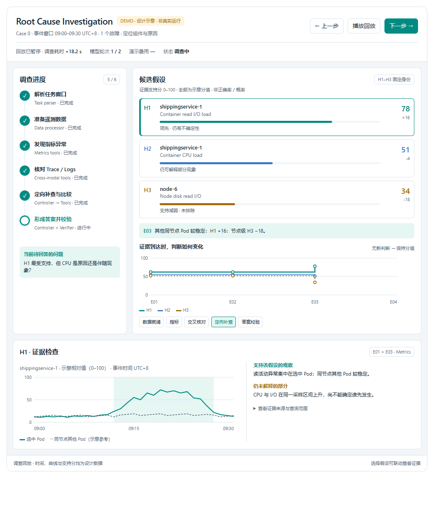

# DEMO — Root Cause Investigation Dashboard

**Interactive design demo with illustrative data. This is not a live RCA run or a benchmark result.**

**交互设计演示：分数、曲线、时间、候选结论及模型轮次均为示意数据，不代表实际诊断结果。**

## Open the demo

Download [`index.html`](index.html) using GitHub's **Download raw file** action, then open the downloaded file in a current Chrome, Edge or Firefox browser. It works locally without installing packages, starting a server or supplying an API key. GitHub's normal file view displays source code; this upload does not configure GitHub Pages hosting.

下载 `index.html` 后用浏览器直接打开即可。GitHub 文件页面展示的是源码，并非在线运行页面。

## Interactions

- **播放回放 / 暂停回放**: replay or pause the illustrative investigation.
- **上一步 / 下一步**, or the event buttons: inspect a particular investigation stage.
- **H1 / H2 / H3**: select a hypothesis and inspect its supporting observations and unresolved questions.
- **查看证据来源与查询范围**: expand the provenance fields proposed for future real-data integration.
- The final event shows a selected answer with remaining uncertainty. Completed and structurally valid do not mean causally correct.

For example, select **定向补查**, then **H3**: the evidence panel explains why the node-wide hypothesis is weakened. Select **交叉核对** to see a stage where the support scores stay unchanged.

## Files and scope

| File | Purpose |
| --- | --- |
| `index.html` | Complete standalone demo, including local state persistence when browser storage is available. |
| `source.html` | Editable interface fragment from which the standalone page was exported. |
| `preview.png` | Screenshot of this demo using illustrative data. |

The demo contains one illustrative case. The proposed 20-task overview, live telemetry connector and real per-round hypothesis scoring are not implemented here. Support scores are not calibrated probabilities and do not sum to 100. The incident-time axis is distinct from investigation elapsed time. Actual agent outputs and runtime code are not changed by this demo.

There are no model calls, telemetry uploads, external script downloads or model charges. If local browser storage is unavailable, the interaction still works but replay position may not survive a reload. The optional in-conversation layout controls are not required by the standalone page.

## Validation and authorship

The exported standalone page was checked in Microsoft Edge with network access disabled: playback, step navigation, hypothesis selection and the final state worked. Desktop and narrow layouts were checked for horizontal overflow. No live model or benchmark evaluation was run for this demo.

Created with OpenAI Codex from the user's dashboard requirements and reference mockups. The standalone export includes the visualization runtime's local state bridge; it does not require Codex to be running.
